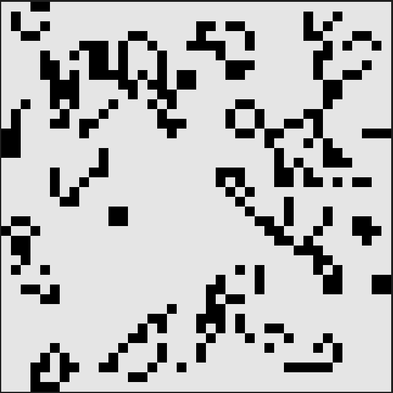
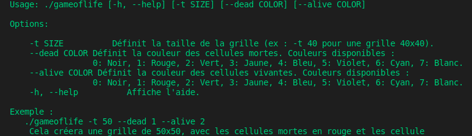

Game of Life
============

Ce projet est une implémentation en C++ du célèbre **Jeu de la vie** de John Conway, un automate cellulaire où chaque cellule peut être "vivante" ou "morte", évoluant selon des règles spécifiques basées sur l'état de ses voisines.

Table des matières
------------------

-   [Aperçu](#aper%C3%A7u)
-   [Installation](#installation)
-   [Utilisation](#utilisation)
-   [Exemple d'Exécution](#exemple-dex%C3%A9cution)
-   [Fonctionnalités](#fonctionnalit%C3%A9s)
-   [Règles du Jeu](#r%C3%A8gles-du-jeu)

Aperçu
------

Le **Jeu de la vie** se déroule sur une grille bidimensionnelle où chaque cellule est soit vivante, soit morte. À chaque étape, la grille évolue en fonction de règles précises déterminant si les cellules survivent, meurent ou naissent.




Installation
------------

1.  Clone ce dépôt GitHub sur ta machine locale :
```bash 
    git clone https://github.com/josiashod/game_of_life.git
    cd game_of_life`
```
2.  Compile le projet avec un compilateur C++ (comme `g++`) :
```bash
    g++ -o gameoflife main.cpp
```

Utilisation
-----------

Une fois le projet compilé, exécute-le à partir de la ligne de commande :

```bash
./gameoflife

./gameoflife -h # pour obtenir l'aide
```
Le programme affichera une simulation du Jeu de la Vie en évoluant tour par tour.

Fonctionnalités
---------------

-   Simulation du Jeu de la Vie sur une grille dynamique.
-   Support pour définir des configurations initiales personnalisées.
-   Simulation interactive avec affichage étape par étape.

Règles du Jeu
-------------

Le **Jeu de la Vie** est basé sur ces quatre règles simples :

1.  **Survie** : Une cellule vivante avec 2 ou 3 voisines vivantes reste vivante.
2.  **Mort par isolement** : Une cellule vivante avec moins de 2 voisines vivantes meurt.
3.  **Mort par surpopulation** : Une cellule vivante avec plus de 3 voisines vivantes meurt.
4.  **Naissance** : Une cellule morte avec exactement 3 voisines vivantes devient vivante.
